  <picture>
    <source media="(max-width: 760px) and (prefers-color-scheme: dark)" srcset="./assets/hero/builder-profile-v2-mobile-dark.svg">
    <source media="(max-width: 760px)" srcset="./assets/hero/builder-profile-v2-mobile-light.svg">
    <source media="(prefers-color-scheme: dark)" srcset="./assets/hero/builder-profile-v2-dark.svg">
    <source media="(prefers-color-scheme: light)" srcset="./assets/hero/builder-profile-v2-light.svg">
    
  </picture>

  [**Email**](mailto:mohaamedtariq12@gmail.com) &nbsp;·&nbsp;
  [**LinkedIn**](https://www.linkedin.com/in/mohamed-tarek-184510337/) &nbsp;·&nbsp;
  [**GitHub**](https://github.com/MohaMedTArEk912)

## Hey, I'm Mohamed Tarek 👋

I'm a **Software Engineer** based in Cairo, Egypt, focused on **Full-Stack Web Development and DevOps / Cloud Engineering**. I build modern, scalable web applications, engineer resilient backend services, and automate containerized cloud infrastructure.

I hold a Bachelor's Degree in Computer Science and Information (Software Engineering Department, 2022–2026) from Helwan University. Whether leading agile engineering teams or architecting high-performance real-time systems, I focus on delivering clean, maintainable software paired with reliable automated deployment pipelines.

## What I Build

- **Full-Stack Applications:** End-to-end web apps using the MERN stack (MongoDB, Express.js, React, Node.js), TypeScript, RESTful APIs, and Tailwind CSS.
- **Real-Time Systems:** Live collaboration platforms, WebSocket communication, telemetry, and competitive quiz engines using Socket.IO.
- **DevOps & Cloud Infrastructure:** Automated CI/CD pipelines (GitHub Actions, Jenkins), containerization & orchestration (Docker, Kubernetes), Infrastructure as Code (Terraform, Ansible), and AWS cloud deployments.
- **AI & Developer Platforms:** AI-powered engineering tools transforming requirements into architecture blueprints, database designs, API schemas, and Git workflows.
- **Observability & Reliability:** Comprehensive metrics, health checks, and dashboard monitoring with Prometheus and Grafana.

## Selected Work

| Project | What I built | My role · Current state |
| --- | --- | --- |
| [**Akasha-Platform**](https://github.com/MohaMedTArEk912/Akasha-Platform) | AI-powered software engineering platform that transforms ideas into complete architecture, DB design, API planning, Git integration, and real-time collaboration. | Team Lead · Software Engineer Graduation Project |
| [**Quiz-Platform**](https://github.com/MohaMedTArEk912/Quiz-Platform) | MERN-based competitive real-time quiz platform featuring live multi-user rooms, WebSockets via Socket.IO, authentication, and gamification. | Sole Developer Completed Full-Stack Build |
| [**ICU-Management-System**](https://github.com/MohaMedTArEk912/ICU-Management-System) | Healthcare telemetry and patient management backend with Node.js, MongoDB, RESTful APIs, and Socket.IO for real-time intensive care monitoring. | Backend & Real-Time Engineer Completed Project |
| [**Library-Management-System**](https://github.com/MohaMedTArEk912/Library-Management-System) | Modern web catalog and patron management system built with React and Tailwind CSS, delivered through structured code reviews and agile coordination. | Team Lead · Frontend Developer Delivered |
| [**Cloud DevOps Pipeline**](https://github.com/MohaMedTArEk912) | Automated container deployment pipeline featuring Docker containerization, Kubernetes orchestration, Terraform IaC, Jenkins CI/CD, and Prometheus/Grafana monitoring. | DevOps Engineer Awarded 3rd Place · DEPI Track |

## Selected Highlights & Achievements

- **DEPI (Digital Egypt Pioneers Initiative):** **Won 3rd Place for Best Project in Track** across DevOps engineering (CI/CD with GitHub Actions & Jenkins, Docker, Kubernetes, Ansible, Terraform, Prometheus, and Grafana).
- **Helwan University:** Bachelor's Degree in Computer Science and Information — Software Engineering Department (2022–2026).
- **Mahra Tech Certifications:**
  - **MERN-Stack Development Certification:** Comprehensive mastery of MongoDB, Express.js, React, and Node.js for production full-stack systems.
  - **Cyber Security Certification:** Practical training in Network Security and Ethical Hacking.
- **Leadership & Teaching:**
  - **Programming Instructor** at 3C School (2025–2026), mentoring aspiring software developers.
  - **Project Coordinator** at Digilians / Eyouth (2026–Present).

## What I'm Exploring

I'm focused on cloud-native microservice architectures, distributed systems, automated zero-downtime deployments, and leveraging AI tools to accelerate software engineering lifecycles.

## Tools & Technologies

- **Languages:** `TypeScript` · `JavaScript (ES6+)` · `Python` · `Java` · `C` · `SQL` · `HTML5 / CSS3`
- **Frontend Development:** `React` · `Tailwind CSS` · `Responsive UI/UX` · `State Management`
- **Backend & APIs:** `Node.js` · `Express.js` · `RESTful APIs` · `Socket.IO` · `JWT Auth`
- **DevOps & Cloud:** `Docker` · `Kubernetes` · `Terraform` · `Ansible` · `AWS` · `GitHub Actions` · `Jenkins`
- **Monitoring & Observability:** `Prometheus` · `Grafana`
- **Databases:** `MongoDB` · `MySQL` · `Neo4j`
- **Workflow & Environment:** `Git` · `GitHub` · `Linux / Bash` · `Postman` · `Agile / Scrum`

## Contribution Trail

  <picture>
    <source media="(prefers-color-scheme: dark)" srcset="https://raw.githubusercontent.com/MohaMedTArEk912/MohaMedTArEk912/output/github-contribution-grid-snake-dark.svg">
    <source media="(prefers-color-scheme: light)" srcset="https://raw.githubusercontent.com/MohaMedTArEk912/MohaMedTArEk912/output/github-contribution-grid-snake.svg">
    
  </picture>

<strong>Recent public activity</strong>

 

<!-- AUTO:ACTIVITY:START -->
- Aug 24, 2026: pushed 1 commit to [MohaMedTArEk912/Quiz-Platform](https://github.com/MohaMedTArEk912/Quiz-Platform).
- Aug 21, 2026: pushed 1 commit to [MohaMedTArEk912/Quiz-Platform](https://github.com/MohaMedTArEk912/Quiz-Platform).
- Aug 20, 2026: pushed 1 commit to [MohaMedTArEk912/Quiz-Platform](https://github.com/MohaMedTArEk912/Quiz-Platform).
- Aug 12, 2026: pushed 1 commit to [MahmoudEzzat8824/Digilians-Remainder](https://github.com/MahmoudEzzat8824/Digilians-Remainder).
- Aug 7, 2026: pushed 1 commit to [MahmoudEzzat8824/Digilians-Remainder](https://github.com/MahmoudEzzat8824/Digilians-Remainder).
- Aug 4, 2026: pushed 1 commit to [MahmoudEzzat8824/Digilians-Remainder](https://github.com/MahmoudEzzat8824/Digilians-Remainder).
<!-- AUTO:ACTIVITY:END -->

---

  Engineering scalable web applications &amp; reliable cloud infrastructure.

